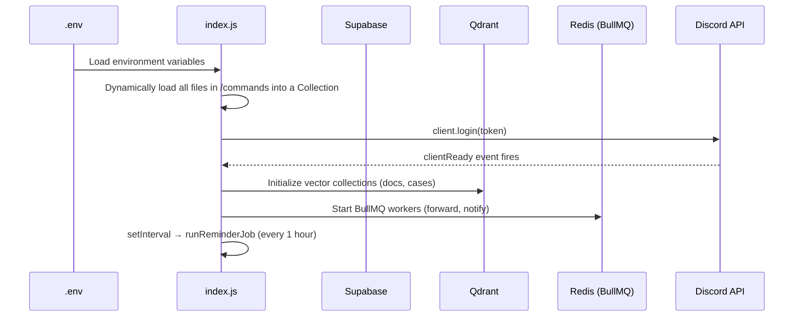
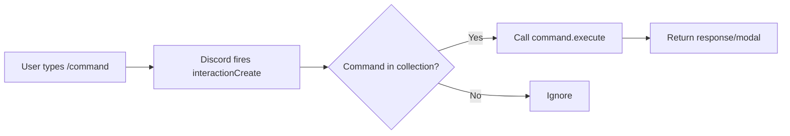
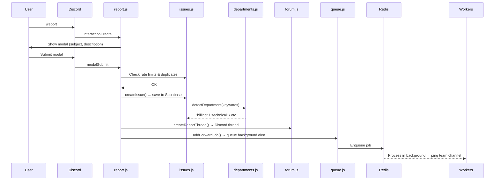
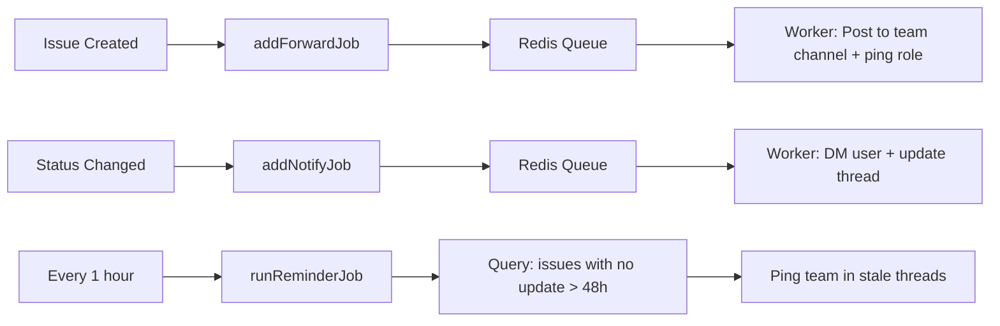

# Discord Support Bot — Architecture & Flow

> **Date**: 2026-03-19  
> **Summary**: A Discord bot that provides AI-powered support using a RAG pipeline (Llama models + Qdrant vector DB + Cloudflare Workers AI), with issue tracking via Supabase and background job processing via BullMQ/Redis.

---

## File Structure

```
Discordbot/
├── index.js                  # Main entry point — sets up client, loads commands, handles core events
├── deploy-commands.js        # CLI script to register slash commands with Discord's API (REST + Routes)
├── package.json              # Dependencies: discord.js, @supabase/supabase-js, bullmq, openai, pino
├── .env                      # Environment variables (Discord token, Supabase URL/key, Redis, Cloudflare creds)
│
├── commands/
│   ├── report.js             # /report — opens a modal for users to file a new issue
│   ├── acknowledge.js        # /acknowledge — team-only, marks an issue as "Acknowledged"
│   ├── resolve.js            # /resolve — team-only, marks an issue as "Resolved" with optional note
│   ├── status.js             # /status — shows the current status of an issue
│   ├── myissues.js           # /myissues — lists all issues filed by the user
│   ├── ping.js               # /ping — bot health check
│   ├── debug.js              # /debug — dev utility for troubleshooting
│   └── close.js              # /close — closes/locks a thread
│
└── lib/
    ├── config.js             # Fetches bot settings from Supabase `bot_config` table (2-min TTL cache)
    ├── supabase.js           # Initializes the Supabase client singleton for DB operations
    ├── qdrant.js             # Interfaces with Qdrant vector DB — stores/searches docs and resolved cases
    ├── issues.js             # Core issue CRUD: create, update status, check limits, find duplicates
    ├── agent.js              # AI orchestrator — chains intent → context → rewriter → RAG → responder
    ├── intent.js             # Classifies messages into CASUAL/QUESTION/COMPLAINT/STATUS/UNCLEAR (Llama-3.1-8b)
    ├── rewriter.js           # Rewrites user questions into search queries, decides if RAG is needed
    ├── responder.js          # Generates final AI response using Llama-3.3-70b, grounded in docs context
    ├── cloudflare.js         # Runs AI models via Cloudflare Workers AI (embeddings, reranking, chat)
    ├── forward.js            # Posts issue summaries to internal team channels and pings relevant roles
    ├── forum.js              # Creates Discord forum threads or text-based threads for new issues
    ├── queue.js              # Defines BullMQ job queues (forwarding issues, notifying users)
    ├── workers.js            # Starts BullMQ workers that process background jobs from the queues
    ├── reminders.js          # Periodic job: finds issues stale for 48h+ and pings the team
    ├── departments.js        # Auto-detects department (billing, technical, etc.) via keyword matching
    └── notify.js             # Sends DMs and thread updates to users when their issue status changes
```

---

## Execution Flow

### 1. Bot Startup



1. `index.js` loads env vars via `dotenv`.
2. All command files from `/commands` are loaded into a Discord.js `Collection`.
3. Bot logs into Discord with its token.
4. On `clientReady`:
   - Qdrant vector collections are initialized.
   - BullMQ workers start listening for background jobs.
   - A hourly reminder job is scheduled to check for stale issues.

---

### 2. Slash Command Handling



- **Registration**: Run `node deploy-commands.js` to sync slash command definitions with Discord's API.
- **Runtime**: `interactionCreate` listener in `index.js` matches the interaction to the loaded command collection and calls `execute()`.

---

### 3. Issue Creation Flow

Issues can be created two ways:

#### Via `/report` Command



#### Via Manual Forum Post

1. `threadCreate` event in `index.js` detects a new thread in the designated forum channel.
2. Bot fetches the starter message content.
3. Same pipeline as above: validate → save to Supabase → detect department → queue team alert.

---

### 4. AI Agent Pipeline (Message Processing)

This is the core intelligence of the bot — triggered when a user sends a message in an active issue thread.

```mermaid
flowchart TD
    A[User sends message in issue thread] --> B["messageCreate (index.js)"]
    B --> C[Save message to Supabase]
    C --> D[runAgent()]

    D --> E["① classifyIntent (intent.js)"]
    E -->|CASUAL| F[Skip AI — no response needed]
    E -->|QUESTION / COMPLAINT / STATUS| G["② fetchContext (agent.js)"]
    E -->|UNCLEAR| G

    G --> G1[Fetch last 12 messages + issue details]
    G1 --> H["③ rewriteQuery (rewriter.js)"]
    H --> I{RAG search needed?}
    I -- No --> K["⑥ generateResponse (responder.js)"]
    I -- Yes --> J["④ RAG Search"]

    J --> J1["embed (cloudflare.js)"]
    J1 --> J2["search (qdrant.js) — Docs + Past Cases"]
    J2 --> J3["rerank (cloudflare.js)"]
    J3 --> K

    K --> L{Confident answer?}
    L -- Yes --> M[Send AI response in thread]
    L -- No / ESCALATE --> N["Ping team role in thread"]
    N --> O[Provide brief summary for human responder]
```

#### Step-by-step:

| Step | Module | Model | Purpose |
|------|--------|-------|---------|
| ① Intent Classification | `intent.js` | Llama-3.1-8b | Classifies message as `CASUAL`, `QUESTION`, `COMPLAINT`, `STATUS`, or `UNCLEAR` |
| ② Context Assembly | `agent.js` | — | Gathers last 12 messages + issue metadata from Supabase |
| ③ Query Rewriting | `rewriter.js` | Llama-3.1-8b | Converts user message into an optimized search query; decides if RAG is needed |
| ④ Embedding | `cloudflare.js` | Cloudflare Workers AI | Creates vector embedding of the rewritten query |
| ⑤ RAG Search + Rerank | `qdrant.js` + `cloudflare.js` | Qdrant + Reranker | Searches docs & past cases in Qdrant, reranks by relevance |
| ⑥ Response Generation | `responder.js` | Llama-3.3-70b | Generates grounded answer using top RAG results as context |

- If the AI is not confident enough, it returns `ESCALATE` → the bot pings the relevant team role (e.g., `@ROLE_BILLING`) in the thread and provides a summary for the human responder.

---

### 5. Background Jobs (BullMQ/Redis)



| Job | Trigger | What It Does |
|-----|---------|--------------|
| **Forward** | Issue created | Posts a summary to the internal team channel and pings the relevant department role |
| **Notify** | Issue status changed | Sends a DM to the user and updates the thread with the new status |
| **Reminder** | Every hour (cron-like) | Finds issues with no activity for 48+ hours and pings the team |

---

### 6. Dynamic Configuration

Bot behavior is controlled via a Supabase `bot_config` table (not hardcoded):

- `lib/config.js` fetches settings on demand with a **2-minute TTL cache**.
- Allows toggling features (e.g., enabling/disabling pings, changing model params) **without restarting the bot**.

---

## Key Architectural Patterns

| Pattern | Implementation |
|---------|---------------|
| **Modular commands** | `/commands` directory with `execute()` exports, loaded dynamically — similar to Discord.py cogs |
| **Separation of concerns** | `lib/` for business/AI logic, `commands/` for Discord interaction logic, `index.js` for wiring |
| **Multi-stage AI pipeline** | Intent → Rewriter → RAG → Reranker → Responder — each stage is an independent, testable module |
| **Async background processing** | BullMQ/Redis decouples slow tasks (DMs, team pings) from Discord's 3-second interaction deadline |
| **Dynamic config** | Supabase-backed config with caching — no redeploy needed for setting changes |
| **Dual issue entry** | Supports both `/report` modal flow and manual forum thread creation |
